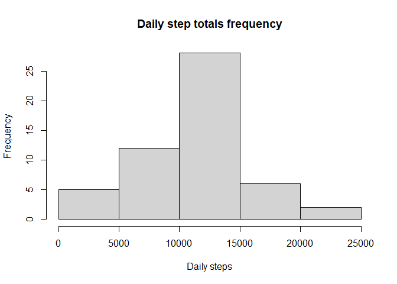
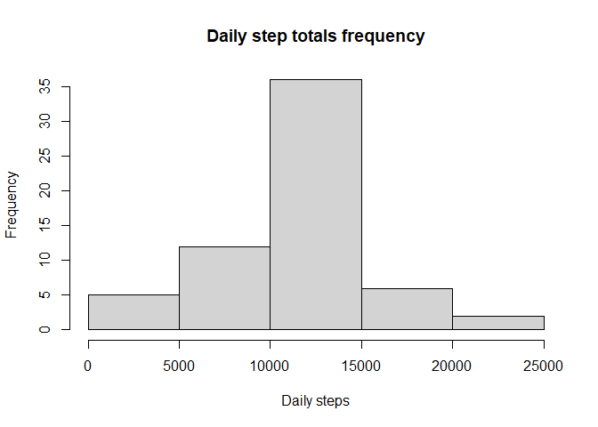
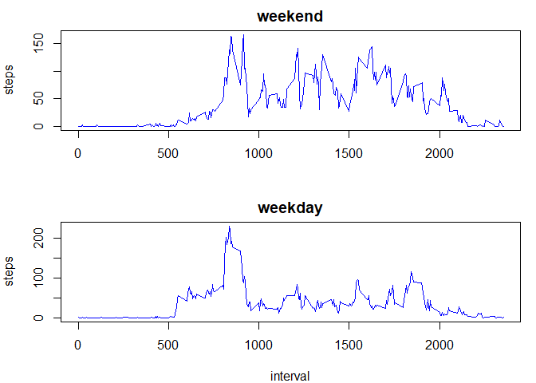

### Kostis Korozis

## Loading and preprocessing the data

```r
#reading the data and taking the non-NAs
stepsdata <- read.csv("activity.csv", header = TRUE, sep = ",")
non_na_steps <- subset(stepsdata, is.na(stepsdata$steps) == FALSE)
```
## What is mean total number of steps taken per day?

```r
library(dplyr)
```

```
## 
## Attaching package: 'dplyr'
```

```
## The following objects are masked from 'package:stats':
## 
##     filter, lag
```

```
## The following objects are masked from 'package:base':
## 
##     intersect, setdiff, setequal, union
```
We 'll use the dplyr package to group the data by date, ending up with a dataframe containing rows of days and total numbers of steps for that day.

```r
#grouping the non-NAs by date, histogram and summarizing for total daily steps
daily_steps <- summarize(group_by(non_na_steps, date), steps = sum(steps))
```

```
## `summarise()` ungrouping output (override with `.groups` argument)
```

```r
hist(daily_steps$steps, xlab = "Daily steps", ylab = "Frequency", main = "Daily step totals frequency")
```

<!-- -->

```r
summary(daily_steps)
```

```
##      date               steps      
##  Length:53          Min.   :   41  
##  Class :character   1st Qu.: 8841  
##  Mode  :character   Median :10765  
##                     Mean   :10766  
##                     3rd Qu.:13294  
##                     Max.   :21194
```
According to the data, the average number of steps per day is: 

```
## [1] 10766.19
```

## What is the average daily activity pattern?
First we group the data by interval and calculate the average number of steps for that interval. In the resulting graph we get a picture of the average daily activity. 

```r
#summarizing for average number of steps each interval
interval_steps <- summarize(group_by(non_na_steps, interval), steps = mean(steps))
```

```
## `summarise()` ungrouping output (override with `.groups` argument)
```

```r
#times series of average steps per 5m-interval
with(interval_steps, plot(interval, steps, type = "l"))
```

<!-- -->

On average the most steps are taken at the following interval:

```r
#max steps interval
subset(interval_steps, steps == max(steps))[1,]
```

```
## # A tibble: 1 x 2
##   interval steps
##      <int> <dbl>
## 1      835  206.
```


## Imputing missing values
Our initial data has missing values for various reasons. The total number of rows with missing data are:

```r
#number of rows with NA values for steps
dim(stepsdata)[1] - dim(non_na_steps)[1]
```

```
## [1] 2304
```
We'll use the average number of steps for a given interval (calculated in previous section) and reference that to fill in the missing values for each day and interval.

```r
#filling up a new dataframe where the NA values are set equal to the average for that interval
fixed_stepsdata <- stepsdata
for (i in 1:dim(stepsdata)[1]){
  if (is.na(fixed_stepsdata$steps[i]) == TRUE) {
    fixed_stepsdata$steps[i] <- subset(interval_steps, fixed_stepsdata$interval[i] == interval_steps$interval)$steps
  }
}
```
Next we summarize as previously and end up with slightly different summary statistics. In the resulting histogram we have a few more occurrences of the average daily total steps (since we put them there), with the other frequencies remaining the same.

```r
#summarizing for total daily steps with fixed data
daily_steps <- summarize(group_by(fixed_stepsdata, date), steps = sum(steps))
```

```
## `summarise()` ungrouping output (override with `.groups` argument)
```

```r
hist(daily_steps$steps, xlab = "Daily steps", ylab = "Frequency", main = "Daily step totals frequency")
```

<!-- -->

```r
summary(daily_steps)  
```

```
##      date               steps      
##  Length:61          Min.   :   41  
##  Class :character   1st Qu.: 9819  
##  Mode  :character   Median :10766  
##                     Mean   :10766  
##                     3rd Qu.:12811  
##                     Max.   :21194
```


## Are there differences in activity patterns between weekdays and weekends?
It is interesting to see what happens when we split the data in weekdays and weekends.

```r
#adding a day column from date
fixed_stepsdata <- mutate(fixed_stepsdata, day = weekdays(as.Date(fixed_stepsdata$date)))
#factor variable is_weekday
is_weekday = factor(fixed_stepsdata$day %in% c("Monday", "Tuesday", "Wednesday", "Thursday", "Friday"), levels = c(TRUE, FALSE), labels = c("weekday", "weekend"))
#replacing day column with its corresponding level (tried to make it in one step, but ended up with this)
fixed_stepsdata <- mutate(fixed_stepsdata, day = is_weekday)

#summarizing the fixed data into 2 dataframes with their corresponging averages
weekday_interval_steps <- summarize(group_by(subset(fixed_stepsdata, day == "weekday"), interval), steps = mean(steps))
```

```
## `summarise()` ungrouping output (override with `.groups` argument)
```

```r
weekend_interval_steps <- summarize(group_by(subset(fixed_stepsdata, day == "weekend"), interval), steps = mean(steps))
```

```
## `summarise()` ungrouping output (override with `.groups` argument)
```
Taking a look at the following graphs we can see clearly that although morning activity remains roughly the same throughout the week, there is more early morning activity on weekdays compared to weekends. There is moderate activity spread throughout the rest of the day on weekends, whereas in weekdays after the morning activities, things slow down for most of the day.

```r
#times series plotting
par(mfrow = c(2,1), mar = c(4,4,2,1), oma = c(0,0,0,0))
with(weekend_interval_steps, plot(interval, steps, main = "weekend", type = "l", col = "blue", xlab = "" ))
with(weekday_interval_steps, plot(interval, steps, main = "weekday", type = "l", col = "blue" ))
```

<!-- -->
